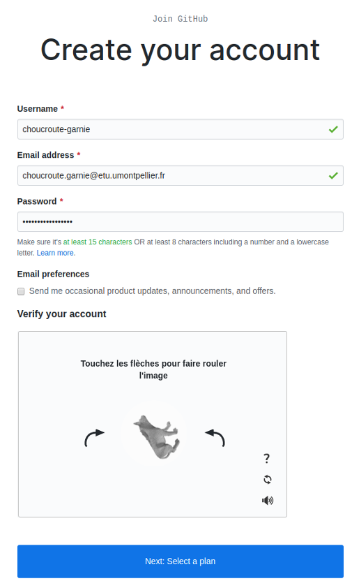
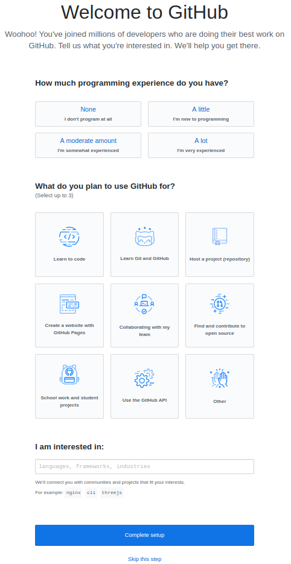

#  Bases de la programmation orientée objet 

### IUT Montpellier-Sète – Département Informatique

* **Cours:** [M2103](http://cache.media.enseignementsup-recherche.gouv.fr/file/25/09/7/PPN_INFORMATIQUE_256097.pdf) - support [ici](https://github.com/IUTInfoMontp-M2103/Ressources)
* **Enseignants:** [Marin Bougeret](mailto:marin.bougeret@umontpellier.fr), [Sébastien Gagné](mailto:sebastien.gagne@umontpellier.fr), [Sophie Nabitz](mailto:sophie.nabitz@univ-avignon.fr), [Jérôme Palaysi](mailto:jerome.palaysi@umontpellier.fr), [Victor Poupet](mailto:victor.poupet@umontpellier.fr), [Petru Valicov](mailto:petru.valicov@umontpellier.fr)
* Le [forum Piazza](https://piazza.com/class/k52c8w685w3210) de ce cours pour poser vos questions
* [Email](mailto:petru.valicov@umontpellier.fr) pour une question d'ordre privée concernant le cours.

Avant de démarrer le TP, vérifiez que vous n'avez pas atteint votre quota d'espace de stockage autorisé :

* placez-vous dans votre `$HOME` et utilisez les commandes suivantes :
    * `du -sh` pour voir combien d'espace vous avez déjà utilisé
    * `du -sh *` pour voir combien d'espace vous avez déjà utilisé pour chaque fichier (sans fichiers cachés)
    * `du -sch .[!.]* *` pour voir combien d'espace vous avez déjà utilisé pour chaque fichier, y compris les fichiers cachés
* Supprimez les fichiers inutiles.
* Pour évitez des problèmes durant vos TPs d'informatique, vous devriez toujours **garder 300-400 Mo d'espace libre**.


## TP 1 : Rappels de Git et premier projet versionné

L'objectif de la première partie de ce TP est de vous introduire/rappeler les concepts principaux liés à la [gestion de version](https://fr.wikipedia.org/wiki/Gestion_de_versions) avec [Git](https://git-scm.com/). Cet outil vous sera indispensable durant l'apprentissage de ce cours. En effet, au délà de la **programmation orientée objets** (l'objectif pédagogique principal du cours), en tant que futur développeur, vous devriez apprendre à être organisé et à collaborer avec d'autres développeurs. Vous apprendrez également à ne pas reinventer la roue : l'informatique est aujourd'hui une science très riche, donc savoir se faire assister par des outils informatiques est essentiel. Pour beaucoup d'entre vous ce TP sera la première occasion de se confronter à l'utilisation d'un [IDE](https://fr.wikipedia.org/wiki/Environnement_de_d%C3%A9veloppement), aux [tests unitaires](https://fr.wikipedia.org/wiki/Test_unitaire) et à des outils de gestion de cycle de vie logiciel.

### Introduction à Git et préparation de l'environnement

Pour conserver vos réalisations et permettre à votre enseignant de suivre votre 
avancement vous allez apprendre à versionner votre travail avec Git sur la plateforme collaborative [GitHub](https://github.com/). Pendant ce module, 
vous allez principalement écrire du code pour vous-même et qui sera partagé avec vos enseignants. Lorsque vous allez travailler sur le projet à plusieurs vous allez pouvoir mesurer tout le potentiel d'un gestionnaire de version. Car tout l'intérêt de travailler avec Git c'est de pouvoir __collaborer__ de manière organisée.

#### Création d'un compte Github

Rendez-vous sur la page d'accueil de [GitHub](https://github.com/) :


Cliquez sur _Sign Up_ et dans la page qui apparaît, inscrivez votre nom d'utilisateur. Celui-ci il doit être **obligatoirement** composé de votre prénom et de votre nom séparé par le caractère '-'. Si un utilisateur avec ce nom existe déjà, ajoutez un chiffre à la fin pour éviter les doublons.
Dans le champ "Email Adress" indiquez votre **adresse universitaire**. Attention : il est important que l'adresse soit universitaire afin de pouvoir bénéficier des avantages liés à votre statut d'étudiant. 



Une fois le mot de passe renseigné, cliquez sur le bouton _Next: Select a plan_. Sur l'écran suivant, vous choisirez l'option de base (qui coûte 0 dollars). Le troisième et dernier écran d'enregistrement vous demande des informations sur votre profil. Indiquez que vous êtes un étudiant et que vous comptez utiliser GitHub pour des projets étudiants :



Une fois ces informations renseignées vous pouvez cliquer sur _Complete Setup_ pour définitivement créer votre compte. N'oubliez pas de valider votre adresse email en allant cliquer sur le lien reçu dans votre boîte mail.

#### Paramétrage de votre compte GitHub

Maintenant que votre compte est créé, il faut personnaliser votre profil. GitHub, en plus de vous fournir un moyen simple 
et efficace de conserver votre code en ligne, est aussi un réseau social de développeurs. Pour que votre profil puisse 
être valorisé un jour dans votre carrière pro, vous devez correctement renseigner vos informations.

#### Demande du "Student Pack"

Pour terminer la configuration de votre compte, il vous faut demander la remise académique vous permettant de bénéficier 
de dépôts privés et de nombreux autres avantages. Pour ce faire, il faut vous rendre sur la page suivante : https://education.github.com/pack

Cliquez sur le bouton "Get your pack" et certifiez que vous êtes bien un étudiant. Vérifiez les informations vous concernant et validez le formulaire pour terminer cette demande. Généralement la validation de la demande intervient dans l'heure mais il peut arriver que ça prenne plus de temps donc pas d'inquiétude.

#### Prise en main de Git

Normalement, la plupart d'entre vous a suivi au Semestre 1 le [tutoriel Git](https://gitlabinfo.iutmontp.univ-montp2.fr/valicov/tutoGit1ereAnnee) de l'IUT. Si vous n'avez jamais fait ce tutoriel ou souhaitez vous entraîner un peu plus, notamment sur l'utilisation des branches, vous pouvez utiliser le tutoriel interactif **[Git-It](https://github.com/jlord/git-it-electron)**. 
Cette application est multi-plateforme et pourra donc être utilisée indifférement sur les ordinateurs du département ou 
le vôtre. Elle contient des défis pour l'apprentissage, en utilisant vraiment Git et GitHub, pas des émulateurs. 
Les défis sont à réaliser en ligne de commande et avec GitHub. À la fin, lorsque vous aurez terminé tous les défis, vous aurez de vrais dépôts sur votre compte GitHub et vos carrés verts comme les grands sur votre tableau de contribution.

Téléchargez le fichier **"Git-it-Linux-x64.zip"** , décompressez-le dans votre répertoire `$HOME` et lancez l'exécutable `Git-it`. Une interface en français est disponible si l'anglais n'est pas votre tasse de thé. La première étape du tutoriel (sur la création d'un compte GitHub) peut être passée car vous l'avez déjà réalisée dans la précédente étape du TP.

Ultérieurement, lorsque vous aurez oublié tout ce que le tuto vous a appris, vous pourrez utiliser ce mini [document](https://pageperso.lis-lab.fr/~petru.valicov/Cours/archives/Aix/M2104/Demarrer%20avec%20Git) qui résume les fonctionnalités principales de Git.


#### Configuration locale de Git

N'oubliez pas de configurer correctement Git sur votre machine.

Ouvrez le fichier `~/.gitconfig` avec votre éditeur de texte favori et renseignez votre nom, prénom et email dans la 
section `[user]`.
```
# Personnalisez les champs ci-dessous!
[user]
username = choucroute-garnie
name = Choucroute Garnie
email = choucroute.garnie@etu.umontpellier.fr
```

### Création de votre fork du TP1
Vous allez pouvoir commencer à travailler sur vos TP. Désormais le rendu, l'évaluation et le suivi de votre travail passeront par GitHub. La première chose que vous allez donc faire est de créer un fork d'un dépôt.

Pour ce faire, cliquez sur **[CE LIEN](https://classroom.github.com/a/ME6cR_-_)** !

GitHub va vous créer un dépôt contenant un fork du dépôt __IUTInfoMontp-m2103/tp1__ et s'appellant __IUTInfoMontp-m2103/tp1-votreUsername__. Ce dépôt sera privé et vous apparaîtrez automatiquement comme contributeur de ce projet pour y pousser votre travail. Les enseignants du module seront automatiquement intégrés en tant que contributeurs également. Cette façon de faire permet d'une part de centraliser et uniformiser les rendus de chaque étudiant et, d'autre part, aux enseignants de suivre plus facilement leur travail. Cela permet également de partager plus facilement une base de code et veiller au respect des consignes en y intégrant une batterie de tests. Mais cela on le verra plus tard...
Vous allez  cloner le fork GitHub 'IUTInfoMontp-m2103/tp1-votreUsername' sur votre machine et travailler désormais localement tout en "versionnant" votre code et en poussant régulièrement vos réalisations.

### À faire pour chaque exercice 
Une fois qu'un exercice sera terminé, n'oubliez pas de pousser vos modifications sur votre fork de la manière suivante (dans cet exemple on suppose que vous êtes sur la branche master) :
```sh
~/tpPOO/tp1-VotreUsername$ git add fichiers_que_vous_avez_modifié
~/tpPOO/tp1-VotreUsername$ git commit -m "Validation de l'exercice 1"
~/tpPOO/tp1-VotreUsername$ git push origin master
```

**Remarque importante** : Rappelez-vous qu'un dépôt contient uniquement les fichiers nécessaires pour qu'un collaborateur puisse reconstruire le projet dans son propre environnement, et surtout _rien de plus_. Donc aucune information personnelle, aucun résultat de compilation, aucune configuration de son propre environnement de travail, ...

### Un petit Salut le Monde qui va bien !
#### Exercice 1
Dans la méthode principale de la classe `HelloWorld` faites afficher le message _"Salut le monde"_.
1. Dans un terminal, compilez, exécutez et vérifiez votre programme.
2. Versionnez votre travail avec `git add` + `git commit`.
3. Faites un `git push` sur le dépôt GitHub et comparez avec votre répertoire local. Quelle différence constatez-vous et pourquoi ?

En règle générale une séparation entre le code source et le byte code est nécessaire pour une meilleure lisibilité de votre programme. Ce qui est généralement conseillé c'est d'avoir au moins deux répetoires à la racine de votre projet. Par exemple `src` + `bin` ou encore `src` + `target`. Pour les différentes options de compilation : https://docs.oracle.com/javase/8/docs/technotes/tools/windows/javac.html
