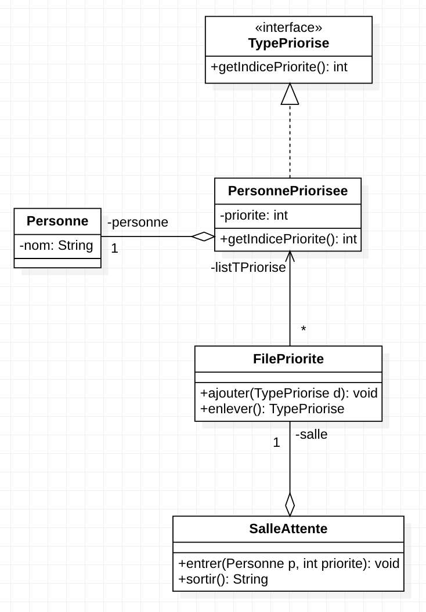

### Tp10 : Héritage, généricité et exceptions 

Diagramme de classes de la partie 1 : 
#

Ex1 Q7 :
Afin de permettre à l'utilisateur de choisir le classement qu'il souhaite, il faudrait commencer par créer une classe 
abstraite contenant les fonctions `public void ajouter (TypePriorise d)` et `public TypePriorise enlever()`. Puis, créer 
une classe héritant de la classe abstraite pour chaque classement voulu. Ainsi, dans chacune des ces classes "filles", 
les fonctions `ajouter` et surtout `enlever`, ajouteraient et enlèveraient les elements suivant le classement voulu. Par la 
suite, il suffirait de choisir le type de classe "fille" voulu pour l'attribut de la classe `SalleAttente` et de ce 
fait, les éléments seraient classés dans l'ordre souhaité.  