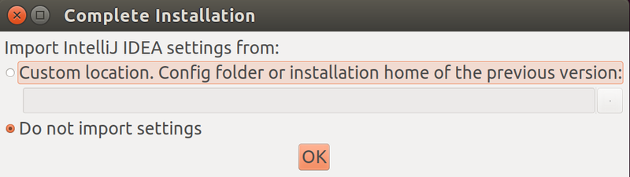
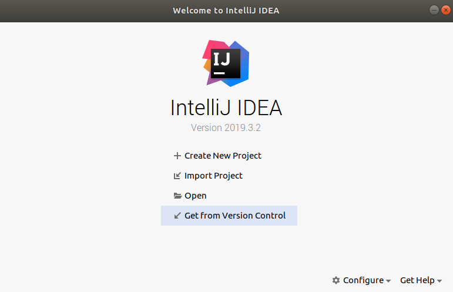
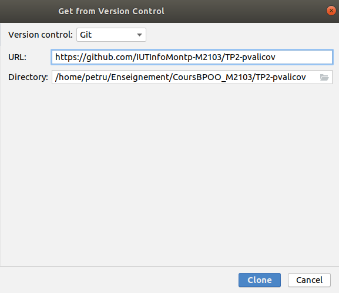
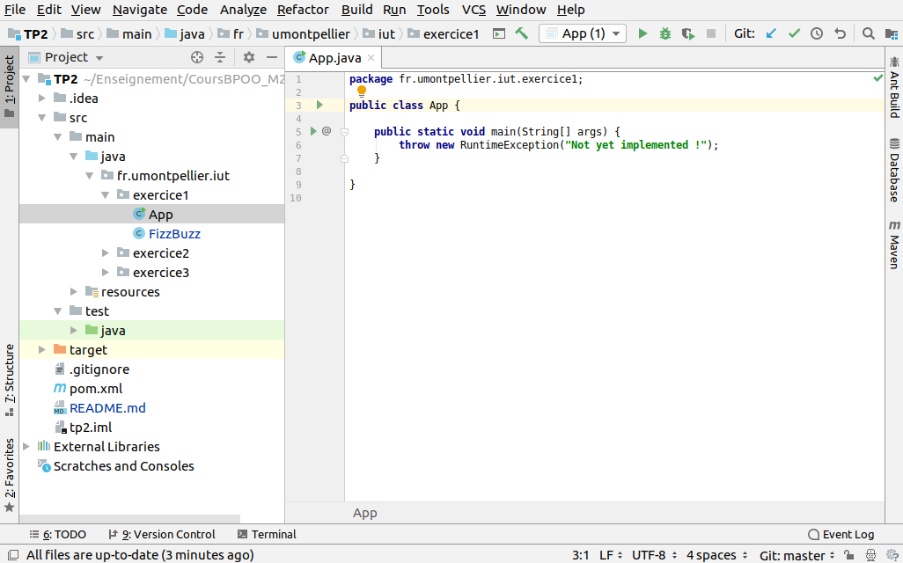
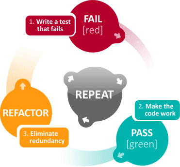
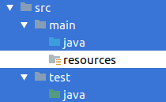
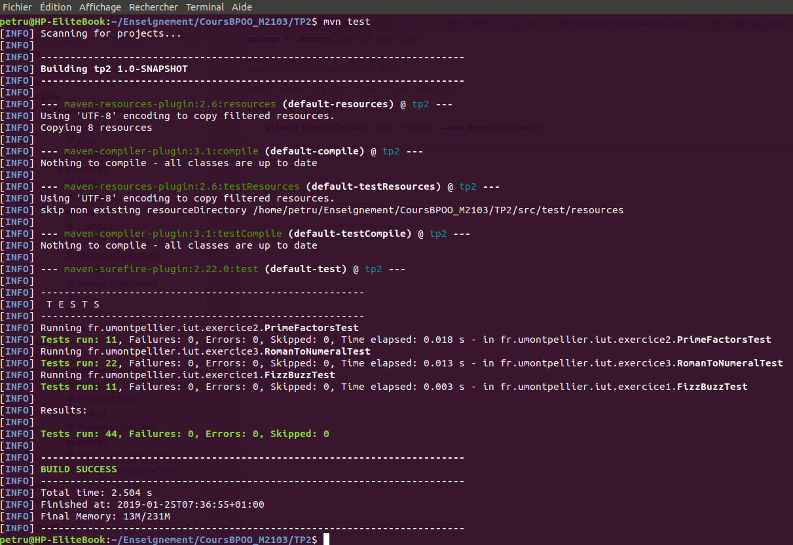

#  Bases de la programmation orientée objet

### IUT Montpellier-Sète – Département Informatique

* **Cours:** [M2103](http://cache.media.enseignementsup-recherche.gouv.fr/file/25/09/7/PPN_INFORMATIQUE_256097.pdf) - support [ici](https://github.com/IUTInfoMontp-M2103/Ressources)
* **Enseignants:** [Marin Bougeret](mailto:marin.bougeret@umontpellier.fr), [Sébastien Gagné](mailto:sebastien.gagne@umontpellier.fr), [Sophie Nabitz](mailto:sophie.nabitz@univ-avignon.fr), [Jérôme Palaysi](mailto:jerome.palaysi@umontpellier.fr), [Victor Poupet](mailto:victor.poupet@umontpellier.fr), [Petru Valicov](mailto:petru.valicov@umontpellier.fr)
* Le [forum Piazza](https://piazza.com/class/k52c8w685w3210) de ce cours pour poser vos questions
* [Email](mailto:petru.valicov@umontpellier.fr) pour une question d'ordre privée concernant le cours.


Avant de démarrer le TP, vérifiez que vous n'avez pas atteint votre quota d'espace de stockage autorisé :

* placez-vous dans votre `$HOME` et utilisez les commandes suivantes :
    * `du -sh` pour voir combien d'espace vous avez déjà utilisé
    * `du -sh *` pour voir combien d'espace vous avez déjà utilisé pour chaque fichier (sans fichiers cachés)
    * `du -sch .[!.]* *` pour voir combien d'espace vous avez déjà utilisé pour chaque fichier, y compris les fichiers cachés
* Supprimez les fichiers inutiles.
* Pour évitez des problèmes durant vos TPs d'informatique, vous devriez toujours **garder 300-400 Mo d'espace libre**.

## TP 2 : Prise en main de l'IDE et travail en mode TDD
Pendant les TP nous vous conseillons d'utiliser un environnement de développement intégré (IDE en anglais).
Les avantages sont multiples : le refactoring du code, l'auto-complétion, la suggestion des méthodes/attributs/classes,
la documentation intégrée, le debuggage, une bonne intégration de Git et GitHub, des tests unitaires etc.
Dans ce cours nous utiliserons l'IDE **[IntelliJ IDEA](https://www.jetbrains.com/idea/)** de chez **[JetBrains](https://www.jetbrains.com)**,
installé sur les machines du département. Il devrait vous faciliter la vie au quotidien dans la réalisation de vos TP.
Bien évidement, rien ne vous empêche d'en utiliser un autre ([Eclipse](https://www.eclipse.org/), [NetBeans](https://netbeans.org/) etc.).

D'abord, et comme pour tous les tps de POO qui vont suivre, vous allez forker ce dépôt pour pouvoir commencer à travailler localement :

https://classroom.github.com/a/t3W9h14X

Contrairement au TP1, ne clonez pas tout de suite vous même ce fork, l'IDE s'en chargera tout seul (cf. ci-dessous).

### Découverte et prise en main de l'IDE


IntelliJ IDEA possède deux versions, la première dite *'communautaire'* est totalement open source et peut être utilisée 
gratuitement par n'importe qui et la seconde dite *'ultimate'* qui est plus riche en fonctionnalités et qui n'est pas 
gratuite. Les deux versions du logiciels sont présentes sur les machines du département. Par chance, comme dans le cas de GitHub, en tant qu'étudiant, vous avez la 
possibilité de pouvoir bénéficier d'une licence pour tous les produits JetBrains. Pour bénéficier de cette remise, il 
vous suffit de remplir [ce formulaire](https://www.jetbrains.com/shop/eform/students).

Quelques minutes après, vous recevrez un email de confirmation suivi d'un second email d'activation où vous devrez accepter 
les conditions d'utilisation et choisir un nom d'utilisateur et un mot de passe. Conservez précieusement ces 
informations dans un coin identifié de votre cerveau car c'est grâce à elles que vous pourrez importer votre licence 
chez vous et dans les salles de TP.

**Premier lancement de l'IDE**

Sur les postes Linux du département informatique de l'IUT de Montpellier, IntelliJ IDEA Ultimate est installé dans `/opt/ide-Ultimate/` :
```
~/RepertoireCourant$  cd /opt/ide-Ultimate/bin
/opt/ide-Ultimate/bin$  ./idea.sh
```

Après le chargement, vous devriez tomber sur une première fenêtre vous proposant d'importer vos paramètres. Vous pouvez laisser sur 'Do not import settings' et valider :



À partir de là vous allez tomber sur la partie de personnalisation de votre installation pour qu'elle corresponde à vos besoins. Sur l'aspect esthétique, choisissez ce qui vous convient le mieux. En ce qui concerne les différents plugins à intégrer, à priori, les options installées par défaut sont suffisantes, donc vous choisirez l'installation par défaut.

À la fin, si vous avez lancé la version IntelliJ IDEA Ultimate, vous allez saisir vos données de connexion pour activer la licence et pour terminer le paramétrage de votre IDE. Pour la version IntelliJ IDEA Community, vous n'avez pas à vous authenthifier et pouvez passer cette étape.

**Import du projet dans l'IDE**

Une fois arrivé sur la fenêtre de démarrage de l'IDE, vous devez choisir comment vous souhaitez démarrer le travail. Pour commencer votre TP, il faut cloner votre dépôt Git, vous choisirez donc l'option *Get from Version Control* :



Le repository sera celui correspondant à votre TP sur GitHub :



Sur certaines machines, au lancement du projet, il se peut que l'IDE vous demande d'indiquer le SDK à utiliser (grosso modo c'est l'ensemble d'outils logiciels qui permettent de faire tourner des programmes Java). Vous pouvez choisir le SDK 1.11, mais 1.8 fera également l'affaire.
Lorsque vous ouvrez votre projet Java, la fenêtre d'affichage de votre IDE devrait rassembler à quelque chose comme ceci :



Prenez quelques minutes pour observer l'interface utilisateur. Les éléments principaux :
* à gauche : l'arborescence de votre projet Java
* centre-droite : la fenêtre d'édition où vous allez taper vos programmes
* en bas : le terminal où seront affichés les messages concernant l'exécution de vos programmes


### Workflow

Maintenant que vous savez utiliser Git en ligne de commande, que vous avez forké, importé et ouvert le TP dans votre IDE, 
vous êtes en capacité de travailler sur vos exercices. Pour cette séance nous vous proposons de suivre un workflow particulier pour résoudre vos exercices progressivement et en consolidant 
progressivement un filet de sécurité qui vérifiera que votre code continue à bien faire ce qu'il doit. Il s'agit d'un premier aperçu de ce qu'on appelle le Développement Piloté par les Tests ([Test-Driven Development](https://fr.wikipedia.org/wiki/Test_driven_development) ou TDD pour faire court). 

Le TDD est une méthode de développement de logiciels qui consiste
à travailler sur des cycles de développement très courts. La conception apparaît au fur et à mesure du développement en commençant à écrire les tests avant le code applicatif. Ceci favorise une meilleure compréhension du problème. Pour le développeur, les tests vont constituer une spécification technique exécutable et vérifiable à tout 
moment. Ainsi en rajoutant des tests, le développeur converge progressivement à la fois vers une spécification plus fine 
et un code fonctionnel associé.

Ci-dessous le déroulement d’un cycle :
1. Écrire un premier test automatique qui est censé définir une nouvelle fonctionnalité. Le test
doit s’écrire avant la fonctionnalité voulue, il est donc censé échouer initialement (normal, car vous n'avez encore rien programmé).
2. Écrire le code __minimal__ suffisant pour passer le test (principe _BabySteps_).
3. Vérifier que le test passe.
4. __Réfactoriser__ (simplifier, améliorer, optimiser etc.) tout le code tout en gardant la fonctionnalité. Durant cette étape les tests écrits préalablement sont exécutés en permanence pour certifier la validité des changements.


Ce workflow se décrit par le triptyque "RED, GREEN, REFACTOR" dans le schéma suivant :



Le workflow que vous devrez suivre va reprendre la même structure, mis à part qu'au début, les tests vous seront donnés pour vous faire découvrir cette méthode sans trop de douleur.

#### Et au fait les tests, c'est quoi ?

Un **test unitaire** est une méthode écrite par le programmeur afin de vérifier qu'une fonctionnalité _précise_ et _élémentaire_ fonctionne correctement.
Le terme _unitaire_ insiste sur le côté "élémentaire" de la fonctionnalité (unité) à tester.

L'outil le plus répandu pour gérer les tests unitaires en Java est le framework [JUnit](https://junit.org/junit5/).
Les tests sont écrits dans une classe Java comme vous avez l'habitude.
La différence entre les fonctions "normales" et les fonctions de test est l'annotation `@Test`.
Celle-ci doit précéder chaque test unitaire. Exemple :
```java
import static org.junit.jupiter.api.Assertions.assertEquals;
import org.junit.jupiter.api.Test;

class MaPetiteClasseDeTests {
    
    @Test
    void monJoliPremierTest() {
        assertEquals(1 + 2, 3); // On vérifie que 1 + 2 vaut bien 3
    }
}
```

Pour exécuter les tests, la façon la plus simple est d'utiliser votre IDE : ouvrir la classe contenant le test et utiliser le bouton 'Play' exécuter les tests contenus dans cette classe.
Le résultat de l’exécution s'affiche en bas de la fenêtre de l'IDE :
 * les tests ayant **réussi** sont affichés en **vert**
 * les tests ayant **échoué** sont en **rouge**

Votre IDE vous affiche également la cause de l'échec en vous indiquant le résultat attendu de la fonctionnalité testée
et le résultat effectif.

#### Organisation du projet Java - convention Maven
Pour bien séparer le code de ses tests, nous allons utiliser la convention [Maven](https://fr.wikipedia.org/wiki/Apache_Maven)
dans l'ensemble des TPs de POO.
Ainsi le code est organisé de la façon suivante :


* l'intégralité des sources du projet se trouve dans le répertoire `src/`
* le code source et fichiers source principaux se trouvent dans `src/main`
* tous les fichiers de tests sont dans dans `src/test`


* le code source (ou code applicatif) se trouve dans `src/main/java`
* le code source de test se trouve dans `src/test`


Maven est un system de _build_ et administration de projets Java. Pour faire une analogie vous pouvez le comparer
à l'outil bien connu [make](https://fr.wikipedia.org/wiki/Make) avec lequel vous serez bercés tout au long de vos études.
Utiliser Maven permet de gérer facilement toutes les dépendances du projet (comme les librairies de tests unitaires par exemple).
Il est également utile pour créer le fichier `.jar` du projet : une archive contenant l'ensemble de classes Java et de ressources
 d'un projet informatique (comme `.AppImage` sous Linux ou `.exe` sous Windows).   

Comme indiqué précédemment, dans ce TP les tests unitaires vous seront donnés dans le repertoire de test correspondant.
Vous allez les activer un par un en commentant l'annotation `@Disabled`.

__La règle principale à retenir__ : avant de faire un commit tous les tests qui ne sont pas annotés avec `@Disabled` __doivent
passer__ (pas de messages en rouge dans la console de l'IDE).


### Exercice 1 : Fizz Buzz !

Le kata Fizz Buzz est un des katas les plus connus pour l'apprentissage du TDD.
Une série 'FizzBuzz' de taille `n` est une suite d'entiers positifs où, lorsqu'un multiple de 3 est rencontré on imprime "Fizz", et lorsqu'un multiple de 5 est renctontré on imprime "Buzz". Voici la série FizzBuzz de taille 20 :

1 ; 2 ; Fizz ; 4 ; Buzz ; Fizz ; 7 ; 8 ; Fizz ; Buzz ; 11 ; Fizz ; 13 ; 14 ; FizzBuzz ; 16 ; 17 ; Fizz ; 19 ; Buzz

Implémentez la classe `FizzBuzz` qui vous est donnée dans le paquetage `fr.umontpellier.iut.exercice1`. Cette classe contient deux fonctions qu'il faudra compléter :
  - `getValue(int i)` qui retournera une chaîne de caractères correspondant au nombre `i`dans la série FizzBuzz
  - `computeList(int n)` qui retournera toute la série 'FizzBuzz' jusqu'à la valeur passée en paramètre 

La classe contenant les tests est située dans le répertoire correspondant au paquetage `fr.umontpellier.iut.exercice1` dans l'arborescence `src/test` de votre projet.
Vous activerez les tests les uns après les autres et soumettrez (avec un commit) votre solution après __chaque itération__ du cycle principal du workflow.

La classe principale (contenant le `main`) est la classe `App`, et se trouve dans le paquetage `fr.umontpellier.iut.exercice1`. Implémentez-la (supprimez la ligne qui lève une exception) pour simuler le bon fonctionnement de votre programme.

Même si l'exercice paraît facile, prêtez une attention particulière à l'étape de réfactorisation. Vous vous servirez de votre IDE pour renommer les méthodes ou variables, pour l'autocomplétion etc.


### Exercice 2 : Facteurs Premiers

D'après le Théorème fondamental de l'arithmétique, tout entier strictement positif peut être écrit comme un produit de nombres premiers.
Dans cet exercice il vous est demandé d'implémenter la méthode qui, pour un entier strictement positif donné, renvoie la liste de ses facteurs premiers en ordre croissant.
Par exemple pour l'entier 5, la liste retournée devrait être [5], alors que pour l'entier 12, la liste retournée devrait être [2,2,3].

La méthode que vous devez implémenter est `computeFactors(int)`. Elle est située dans la classe `PrimeFactors` (paquetage `fr.umontpellier.iut.exercice2`) qui renvoie la liste de facteurs premiers pour l'entier passé en paramètre.

Comme pour l'exercice précédent, vous activerez les tests les uns après les autres.  N'oubliez pas de __refactoriser__ (i.e. simplifier/nettoyer/factoriser) le code à chaque étape. Vous soumettrez avec Git votre solution après chaque itération du cycle principal du workflow.

À la fin de l'exercice, pour vous convaincre de la validité de votre code, vous ajouterez deux-trois tests supplémentaires pour deux nombres que vous aurez choisi aléatoirement (par exemple, dans un terminal avec la commande `echo $RANDOM`). Est-ce que votre programme passe ce nouveau test ?


### Exercice 3 : Calculette romaine

Vous êtes chargé de réaliser une calculette simplifiée qui effectue des additions et des soustractions des nombres écrits en numérotation romaine. Dans cette numérotation on utilise des caractères parmi sept lettres de l'alphabet latin : `I`, `X`, `L`, `C`, `D` et `M`. La signification en numérotation décimale classique est donnée ci-dessous :


| I | V | X  | L  |  C  |  D  |  M   |
|---|---|----|----|-----|-----|------|
| 1 | 5 | 10 | 50 | 100 | 500 | 1000 |


Un nombre romain se lit de gauche à droite en faisant des additions et des soustractions des valeurs des chiffres. Tout symbole qui suit un symbole de valeur supérieure ou égale s’ajoute à celui-ci (exemple : 6 s'écrit `VI`). Tout symbole qui précède un symbole de valeur supérieure se soustrait à ce dernier (exemple : 40 s'écrit `XL`). Par exemple le nombre romain `MLXIII` correspond à 1063 dans la numérotation décimale car il se décompose comme `M`+`L`+`X`+`I`+`I`+`I` = 1000+50+10+1+1+1. Alors que le nombre `XXXIV` vaut 34 car il se décompose comme `X`+`X`+`X`+`IV`=10+10+10+4. Une meilleure façon de voir ce dernier exemple c'est d'utiliser la soustraction `X`+`X`+`X`-`I`+`V`=10+10+10-1+5.

On va se fixer une représentation unique des nombres romains avec les principes suivants :
- Un même symbole n'est pas employé quatre fois de suite (sauf `M`).
- Les soustractions s'effectuent sur un seul symbole (par exemple `XL` est correct et vaut 40, mais il est interdit d'écrire `XXL` pour 30, et on écrira plutôt `XXX`).
- On écrira en respectant l'ordre suivant
   - d'abord les chiffres des milliers (à l'aide uniquement de `M`)
   - puis les chiffres des centaines (à l'aide uniquement de `C`,`D`,`M`)
   - puis les chiffres des dizaines (à l'aide uniquement de `X`,`L`,`C`)
   - puis les chiffres des unités (à l'aide uniquement de `I`,`V`,`X`)
- Pour chacune des 4 étapes ci-dessus, on utilisera le moins de symboles possible.

Par exemple :
- `IL` (pour 49) est interdit (I n'est pas autorisé pour décrire les dizaines), et 49 = `XLIX`
- `XCM` est interdit (car que l'on interprète comme `X` `CM` ou `XC` `M`, cela ne respecte pas l'ordre ci-dessus)
- `VX` (pour 5) est interdit, car `V` utilise moins de symboles
- `XCXX` (pour 110) est interdit, car il faut décrire le chiffre des centaines avec `C`,`D`, `M`.


Faites très attention pour cet exercice de bien respecter le principe du TDD en ajoutant vraiment tout le temps la quantité minimale de code nécessaire à la validation des tests. Si vous suivez cette règle, il se résout très facilement alors qu'en l'abordant de manière générale, il comporte de nombreux pièges pouvant vous faire perdre un temps précieux.

Dans cet exercice, vous allez manipuler la classe [`String`](https://docs.oracle.com/javase/8/docs/api/?java/lang/String.html). Cette classe possède de nombreuses méthodes utilitaires pour manipuler facilement les chaines de caractères.

**Convertisseur de nombres romains**

Écrivez la classe Java `RomanToNumeral` donnée. Cette classe aura une méthode  `getNumeral()` qui prend un nombre romain en paramètre et retourne sa valeur en numérotation décimale (un type `int`). 

N'oubliez pas de faire des "commits" au fur et à mesure !

**Convertisseur de nombres décimaux** 

Écrivez la classe `NumeralToRoman` qui contiendra une méthode `getRoman()`, qui prend un nombre entier en paramètre et retourne sa valeur en numérotation romaine (de type `String` donc).

Est-ce que vos tests sont suffisants ? Que se passe-t-il lors de la conversion `romain` -> `décimal` -> `romain` ?

**Additionneur romain**

En utilisant les deux classes écrites précédemment, créez une classe `RomanAdditionner` qui contiendra une méthode `String compute()`. Cette méthode prendra en paramètre une chaîne de caractères représentant une expression arithmétique romaine telle que :

 - les opérandes sont écrits en numérotation romaine
 - les opérations possibles sont `+` et `-`

Le retour de cette fonction devra correspondre au résultat du calcul de l'expression arithmétique écrit sous forme d'un nombre romain.
Par exemple pour l'expression arithmétique `MMMXL` + `XII` - `CIX` passée en paramètre, la valeur retournée devrait être : `MMCMXLIII`.

Afin de vérifier votre code, vous pouvez écrire quelques tests unitaires dans une nouvelle classe de test (par ex. `RomanAdditionnerTest` dans le paquetage `fr.umontpellier.iut.exercice3`).

### Et ce n'est pas fini !

Vous trouverez d'autres katas qui vous permettront de mieux apprendre la programmation en mode TDD :

http://codingdojo.org/kata/

Dans tous les cas gardez cette citation d'Edsger W. Dijkstra en tête :
> Program testing can be used to show the presence of bugs, but never to show their absence.


### Si l'IDE n'est pas votre tasse de thé...

Naturellement vous pouvez faire le tout en ligne de commandes.
Supposons que vous êtes sur Linux (la démarche étant quasiment identique sur Windows ou MacOS) et que la racine de votre projet est le répertoire `~/POO/TP2`.
Positionnez-vous dans ce répertoire :
```
~/RepertoireCourant$ cd ~/POO/TP2
~/POO/TP2$ ls
~/POO/TP2$ pom.xml  README.md  src  target  tp2.iml
```

Pour compiler le code source de l'exercice 1 à partir de la racine de votre projet :

```
~/POO/TP2$  javac -d target/ src/main/java/fr/umontpellier/iut/exercice1/*.java
```

L'option `-d target` permet d'indiquer que la destination des fichiers compilés est le répertoire `target/`
Également, avec l'option `-sourcepath`, il est possible d'indiquer le chemin où le compilateur va chercher
l'ensemble du code source à compiler :
```
~/POO/TP2$  javac -sourcepath src/ -d target src/main/java/fr/umontpellier/iut/exercice1/*.java
```

Pour exécuter le programme compilé :
```
~/POO/TP2$  cd target/
~/POO/TP2/target$  java fr.umontpellier.iut.exercice1.App
```
L'avantage d'utiliser IntelliJ IDEA est qu'à priori vous n'avez pas à installer les diverses dépendances, l'outil est _"self-contained"_.
En revanche, si vous passez par la console, il se peut que vous soyez amenés à installer ou importer divers outils.
Notamment, pour exécuter les tests unitaires dans un terminal, il faudrait utiliser un exécutable `.jar` correspondant
à la plateforme JUnit et contenant l'ensemble de dépendances nécessaires :
```
~/POO/TP2$  java -jar junit-platform-console-standalone-<version>.jar <Options>
```

La solution ci-dessus peut s'avérer particulièrement pénible lorsque vous avez plusieurs classes de tests,
dans différents packages. Le plus simple, c'est d'utiliser un outil de "build" comme Maven,
[Gradle](https://fr.wikipedia.org/wiki/Gradle), [Ant](https://fr.wikipedia.org/wiki/Apache_Ant), [make](https://fr.wikipedia.org/wiki/Make) etc. 
Par exemple, si Maven est installé sur votre machine vous pouvez exécuter les tests en ligne de commande assez facilement.
Pour cela placez-vous à la racine de votre projet et tapez la commande suivante :

```
~/POO/TP2$  mvn test
```
Le résultat obtenu devrait rassembler à quelque chose comme ceci :


