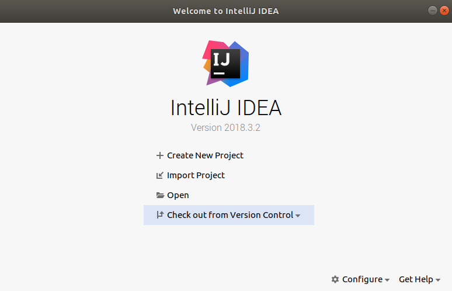
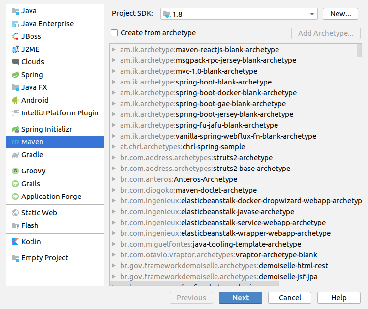
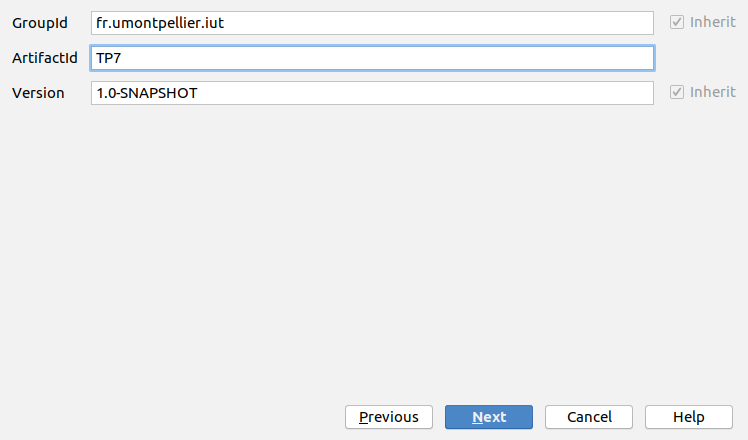
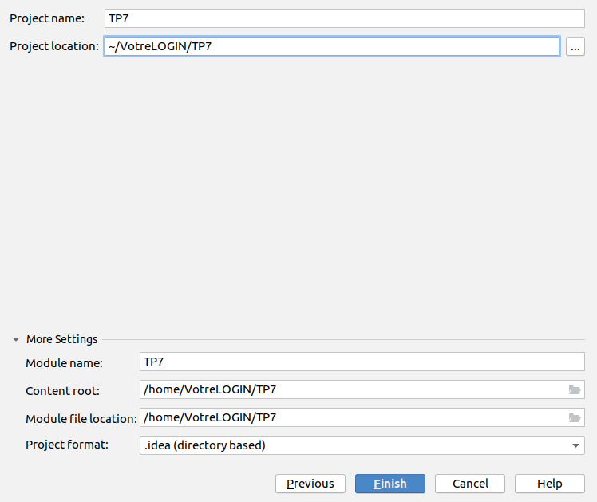

#  Bases de la programmation orientée objet 
### IUT Montpellier-Sète – Département Informatique
* **Cours:** [M2103](http://cache.media.enseignementsup-recherche.gouv.fr/file/25/09/7/PPN_INFORMATIQUE_256097.pdf) - support [ici](https://github.com/IUTInfoMontp-M2103/Ressources)
* **Enseignants:** [Marin Bougeret](mailto:marin.bougeret@umontpellier.fr), [Sébastien Gagné](mailto:sebastien.gagne@umontpellier.fr), [Sophie Nabitz](mailto:sophie.nabitz@univ-avignon.fr), [Jérôme Palaysi](mailto:jerome.palaysi@umontpellier.fr), [Victor Poupet](mailto:victor.poupet@umontpellier.fr), [Petru Valicov](mailto:petru.valicov@umontpellier.fr)
* Le [forum Piazza](https://piazza.com/class/k52c8w685w3210) de ce cours pour poser vos questions
* [Email](mailto:petru.valicov@umontpellier.fr) pour une question d'ordre privée concernant le cours.

Avant de démarrer le TP, vérifiez que vous n'avez pas atteint votre quota d'espace de stockage autorisé :
* placez-vous dans votre `$HOME` et utilisez les commandes suivantes :
    * `du -sh` pour voir combien d'espace vous avez déjà utilisé
    * `du -sh *` pour voir combien d'espace vous avez déjà utilisé pour chaque fichier (sans fichiers cachés)
    * `du -sch .[!.]* *` pour voir combien d'espace vous avez déjà utilisé pour chaque fichier, y compris les fichiers cachés
* Supprimez les fichiers inutiles.
* Pour éviter des problèmes durant vos TPs d'informatique, vous devriez toujours **garder 300-400 Mo d'espace libre**.

## TP7
#### _Thème : Création d’un projet Java et manipulations de quelques collections_

Cliquez sur le lien ci-dessous pour faire votre fork privé du TP (**attention, pas de fork à la main !**):

https://classroom.github.com/a/njGWjWqU

Date limite de rendu de votre code sur le dépôt GitHub : **Dimanche 22 mars à 23h00**

Ce (court) TP a deux buts :

1. Vous apprendre à construire un projet _Java_ avec votre IDE en utilisant une convention standard (ici _Maven_)

2. Reprendre proprement la [Partie 2 du TP6](https://github.com/IUTInfoMontp-M2103/TP6#partie-2) dans ce nouveau projet et améliorer l'efficacité de votre framework de résolution de jeux construit au [TP6](https://github.com/IUTInfoMontp-M2103/TP6), en utilisant les différentes collections vues en [cours](https://pageperso.lis-lab.fr/~petru.valicov/Cours/M2103/BPOO_Genericite_Structures_de_Donnees_x4.pdf).

Dans tous les cas, désormais le code de votre solution du TP6 devrait rester intact. Dans l'exercice 2, vous allez travaillez sur **une copie** du TP6 et vous allez l'améliorer.

### Exercice 1
#### Organisation du projet Java - convention Maven

Depuis les premiers TPs de POO nous avons utilisé la convention [Maven](https://fr.wikipedia.org/wiki/Apache_Maven).
Pour rappel, voici l'organisation du code dans cette convention :


* l'intégralité des sources du projet se trouve dans le répertoire `src/`
* le code source et fichiers source principaux se trouvent dans `src/main`
* tous les fichiers de tests sont dans `src/test`


* le code source (ou code applicatif) se trouve dans `src/main/java`

* le code source de test se trouve dans `src/test`

**Maven** est un system de _build_ et administration de projets Java. Pour faire une analogie vous pouvez le comparer
à l'outil [make](https://fr.wikipedia.org/wiki/Make), qui existe depuis les années '70 et qui est largement utilisé dans
les systèmes de type UNIX. Dans le cas des TPs et projet du cours de POO on aurait pu se contenter d'utiliser **make**
si l'ensemble des dépendances à gérer n'était pas conséquent et lourd à configurer à la main :
* la version du compilateur _Java_
* la version du byte-code _Java_ généré par le compilateur afin de permettre une compatibilité entre des machines n'ayant pas la même version _Java_
* les différentes librairies de tests unitaires (Junit 5.4 actuellement, mais une retro-compatibilité avec JUnit 4)
* etc.

D'autre part, utiliser _make_ pour respecter une organisation des répertoires et des packages _Java_ peut s'avérer long.

Pour gérer tous ces aspects, plusieurs outils de _build_ sont recommandés :
* [Maven](https://fr.wikipedia.org/wiki/Apache_Maven),
* [Gradle](https://fr.wikipedia.org/wiki/Gradle)
* [Ant](https://fr.wikipedia.org/wiki/Apache_Ant)
* et bien d'autres.

Dans ce cours le choix a été porté sur *Maven*, mais on aurait pu très bien utiliser un autre outil (de même qu'on aurait pu
utiliser _C++_, _C#_ ou encore _Python_ pour vous apprendre à programmer en orienté objet...). Vous avez peut-être
remarqué qu'utiliser *Maven* permet de gérer facilement toutes les dépendances du projet. Le fait que l'ensemble des
fichiers sources et exécutables soit organisé et que cette organisation soit faite de manière "transparente" est
clairement un bénéfice. Par exemple, vous n'avez pas eu à installer des logiciels spécifiques, autres que votre IDE pour
faire fonctionner vos programmes _Java_. Il est également utile pour créer le fichier `.jar` du projet -- une archive
contenant l'ensemble de classes _Java_ et de ressources d'un projet informatique (comme `.AppImage` sous Linux ou `.exe` sous Windows).
 
**Remarque** : L'utilisation de *Maven* est indépendante de votre IDE. Que ce soit [IntelliJ IDEA](https://www.jetbrains.com/idea/),
[Eclipse](https://www.eclipse.org/), ou [NetBeans](https://netbeans.org/), la plupart des IDEs de développement _Java_
ont une intégration facile de *Maven*.

L'objectif de cet exercice est de vous apprendre à construire un projet _Java_ en suivant la convention *Maven*
à partir de rien. Nous allons illustrer les étapes pour [IntelliJ IDEA](https://www.jetbrains.com/idea/),
libre à vous d'adapter ce tutoriel pour un autre IDE que vous préférez.

1. Lancez l'IDE et fermer esi nécessaire le projet sur lequel vous étiez en train de travailler précédemment.
Pour ce faire : _File_ &rightarrow; _Close Project_.
Vous devez vous retrouvez avec une fenêtre comme celle-ci :

    

    Cliquez sur _Create New Project_.

2. Une fenêtre de création va apparaître et va rassemble à ceci :

    

    Choisissez le modèle _Maven_ et vérifiez que la SDK correspond à une version supérieure à _Java 1.8_ &rightarrow; _Next_

3. Dans la fenêtre ci-dessous vous devez indiquer les informations permettant d'identifier votre projet parmi la liste
des projets que vous avez déjà créés :

    
  
    * **GroupId** donne identifiant à votre projet. Puisque nous construisons un projet _Java_, il faudrait respecter les
      conventions de nommage du langage. Ici la convention est la même que pour les packages : on indique le domaine dans
      l'ordre inverse. Par exemple, `org.apache.maven`, `org.apache.commons`. Pour ce TP vous allez choisir `fr.umontpellier.iut`.
  
    * **artifactId** est le nom de l'exécutable (fichier `.jar`) qui pourra être créé à partir de ce projet.
  
    * **version** - le nom de version si ce code est destiné à être distribué. Ici vous pouvez laisser 1.0-SNAPSHOT. Cela
      voudra dire qu'il s'agit de la version _en cours de développement_ de la version 1.0 de votre logiciel. Pour la version
      finale, le mot-clé SNAPSHOT devra être enlevé.
  
    Cliquez sur _Next_.

4. La page suivante vous permet d'indiquer le répertoire où va résider votre projet :

    

    Après avoir indiqué le répertoire, cliquez sur _Finish_.

5. Et voilà, vous venez de créer un projet _Java_ en suivant la convention **Maven**. La page que vous allez trouver, va rassembler
à quelque chose comme ceci :

    

    Notez le fichier XML qui vous sera affiché (`pom.xml`). Ce fichier, appelé
    [_Project Object Model_](https://maven.apache.org/guides/introduction/introduction-to-the-pom.html), contient
    l'ensemble des informations concernant votre projet et sa configuration. C'est ici que seront stockées l'ensemble des
    dépendances de votre projet. Si vous utilisez la version 1.8 de _Java_, vous pouvez remplir votre `pom.xml` comme suit :

    ```xml
    <?xml version="1.0" encoding="UTF-8"?>
    <project xmlns="http://maven.apache.org/POM/4.0.0"
             xmlns:xsi="http://www.w3.org/2001/XMLSchema-instance"
             xsi:schemaLocation="http://maven.apache.org/POM/4.0.0 http://maven.apache.org/xsd/maven-4.0.0.xsd">
        <modelVersion>4.0.0</modelVersion>
        <groupId>fr.umontpellier.iut</groupId>
        <artifactId>TP7</artifactId>
        <version>1.0-SNAPSHOT</version>
        <properties>
            <maven.compiler.source>1.8</maven.compiler.source>
            <maven.compiler.target>1.8</maven.compiler.target>
            <project.build.sourceEncoding>UTF-8</project.build.sourceEncoding>
        </properties>
        <dependencies>
            <dependency>
                <groupId>org.junit.jupiter</groupId>
                <artifactId>junit-jupiter-engine</artifactId>
                <version>5.4.0-M1</version>
                <scope>test</scope>
            </dependency>
            <dependency>
                <groupId>org.junit.vintage</groupId>
                <artifactId>junit-vintage-engine</artifactId>
                <version>5.4.0-M1</version>
                <scope>test</scope>
            </dependency>
            <dependency>
                <groupId>org.junit.jupiter</groupId>
                <artifactId>junit-jupiter-api</artifactId>
                <version>5.4.0-M1</version>
            </dependency>
        </dependencies>
        <build>
            <plugins>
                <plugin>
                    <groupId>org.apache.maven.plugins</groupId>
                    <artifactId>maven-surefire-plugin</artifactId>
                    <version>2.22.0</version>
                </plugin>
                <plugin>
                    <groupId>org.apache.maven.plugins</groupId>
                    <artifactId>maven-failsafe-plugin</artifactId>
                    <version>2.22.0</version>
                </plugin>
            </plugins>
        </build>
    </project>
    ```
    Pour les autres versions de _Java_ il faudra adapter les lignes correspondantes. Il vous est également conseillé de lire la documentation là-dessus :
    * https://maven.apache.org/what-is-maven.html
    * https://maven.apache.org/guides/introduction/introduction-to-the-pom.html

6. Après avoir effectué les premières modifications du fichier POM de votre projet, il faudra penser indiquer à votre IDE
quand est-ce que vous aimeriez qu'il prenne en compte les changements de ce fichier. Une fenêtre comme celle-ci devrait
apparaître (en bas à droite de votre écran) :

	
   
	Pour faire plus simple, vous pouvez choisir l'option _Enable Auto-Import_ afin que tout changement du fichier POM soit
pris en compte immédiatement.


7. Maintenant, que votre projet est prêt, n'oubliez pas de versionner votre travail avec Git. On vous rappelle rapidement les commandes
   Git à exécuter dans le terminal (attention, si vous utilisez votre IDE pour faire cela, lisez/vérifiez avant de cliquer...) :

    * initialisez la racine de votre projet _Java_ (qui s'appelle sans doute _TP7_) comme un dépôt Git
    * ajoutez votre dépôt privé distant comme _remote_ : `git remote add origin https://github.com/IUTInfoMontp-M2103/TP7-VOTRELOGIN`
    * rappelez-vous l'intérêt du fichier `.gitignore` et ajoutez-le à la racine de votre projet. Vous pouvez récupérer un modèle utilisé
      pour un autre TP fait auparavant (par exemple celui du TP6). Pour les utilisateurs des IDEs autres que [IntelliJ IDEA](https://www.jetbrains.com/idea/)
      (par exemple [Eclipse](https://www.eclipse.org/)) il faudra adapter le `.gitignore`.
    * synchronisez le dépôt distant avec votre dépôt local (avec `git pull origin master` et `git push`); ici vous serez amenés à faire
      une fusion (_merge_) avec le dépôt distant forké par le lien qui vous a été fourni.
 
Désormais tout devrait être fonctionnel et vous pouvez commencer sereinement à créer vos classes _Java_ et programmer
comme d'habitude.

### Exercice 2
Comme pour les TPs précédents, pour cet exercice vous marquerez vos réponses aux questions posées dans un fichier **reponses.md**.

Vous avez sans doute remarqué que la résolution des différentes configurations du Taquin (et même Hanoi) est assez lente. Le but de cet exercice est d'améliorer les temps d'exécution de vos algorithmes en choisissant mieux les structures de données, appelées **collections** en _Java_. Pour ce faire, il faut absolument étudier le [cours sur les collections Java](http://pageperso.lis-lab.fr/~petru.valicov/Cours/M2103/BPOO_Genericite_Structures_de_Donnees_x4.pdf) et lire la documentation dans la littérature ou sur le site d'Oracle. Voici une liste non-exhaustive des différentes classes et interfaces que vous devriez connaître après avoir travaillé sur le cours :
[Collection](https://docs.oracle.com/javase/8/docs/api/java/util/Collection.html),
[Collections](https://docs.oracle.com/javase/8/docs/api/java/util/Collections.html), 
[List](https://docs.oracle.com/javase/8/docs/api/java/util/List.html),
[ArrayList](https://docs.oracle.com/javase/8/docs/api/java/util/ArrayList.html),
[LinkedList](https://docs.oracle.com/javase/8/docs/api/java/util/LinkedList.html), 
[Set](https://docs.oracle.com/javase/8/docs/api/java/util/Set.html), 
[HashSet](https://docs.oracle.com/javase/8/docs/api/java/util/HashSet.html), 
[TreeSet](https://docs.oracle.com/javase/8/docs/api/java/util/TreeSet.html),
[LinkedHashSet](https://docs.oracle.com/javase/8/docs/api/java/util/LinkedHashSet.html),
[Queue](https://docs.oracle.com/javase/8/docs/api/java/util/Queue.html),
[Deque](https://docs.oracle.com/javase/8/docs/api/java/util/Deque.html), 
[PriorityQueue](https://docs.oracle.com/javase/8/docs/api/java/util/PriorityQueue.html),
[Map](https://docs.oracle.com/javase/8/docs/api/java/util/Map.html),
[HashMap](https://docs.oracle.com/javase/8/docs/api/java/util/HashMap.html), 
[TreeMap](https://docs.oracle.com/javase/8/docs/api/java/util/TreeMap.html), etc.

1. Copiez dans le répertoire `src/main/java` l'ensemble des classes et interfaces métiers créées dans la [Partie 2 du TP6](https://github.com/IUTInfoMontp-M2103/TP6#partie-2). Également, copiez dans le répertoire `src/test/java` l'ensemble de classes de tests. Vérifiez que votre programme principal fonctionne correctement. Pensez à mettre toutes ces classes dans un package approprié. Par exemple `fr.umontpellier.iut` si vous comptez vous arrêtez à l'implémentation des algorithmes de résolution; et `fr.umontpellier.iut.framework` ou `fr.umontpellier.iut.traitement` si vous voulez ajouter d'autres composants (comme une interface graphique que vous mettriez dans `fr.umontpellier.iut.affichage`).

    **Rappel important** : Le code de votre projet TP6 devrait rester intact, seuls les fichiers du TP7 peuvent être modifiés. 
    
2. Observez que jusque-là vous avez utilisée les `ArrayList` de _Java_ pour modéliser les variables `dejaVus`, `frontiere`, ainsi que les
fils d'une configuration de jeu donnée (retournés par la méthode `genererFils()` de `JeuPuzzle`). Réflechissez aux inconvénients de cette
structure de données. Que constatez-vous lorsqu'on ajoute un élément dans `dejaVus` ou `frontiere` ? Est-ce qu'une `ArrayList` est appropriée ici ou choisir une autre collection _Java_ serait plus approprié pour votre algorithme ?
   
3. Rappelez-vous la spécification de la variable `dejaVus` et notez le test d'appartenance à `dejaVus` dans la méthode
`mettreAJour(...)` de la classe `Couple`. De manière directe ou indirecte, pour les `ArrayList` ce test d'appartenance se fait en utilisant la méthode `boolean equals(Object o)` redéfinie dans vos classes `Taquin` et `Hanoi`. Proposez une collection plus appropriée pour modéliser la variable `dejaVus` et modifiez
(i.e. refactorisez) votre code de manière correspondante. Justifiez votre choix dans le fichier **reponses.md**.

4. Après avoir fait les changements nécessaires, essayez de résoudre les taquins 3 X 3  qui étaient auparavant particulièrement lents et vérifiez si vous obtenez des améliorations des temps de calcul.
