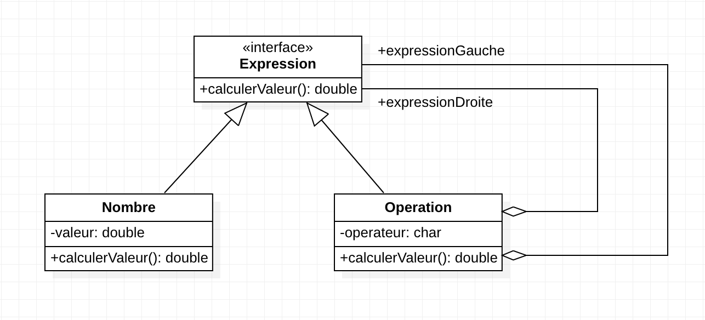
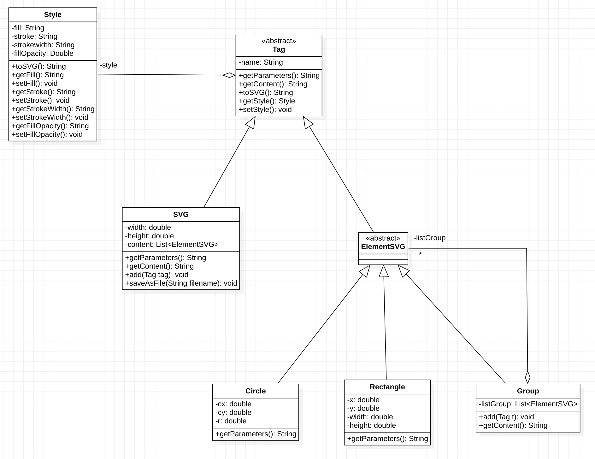
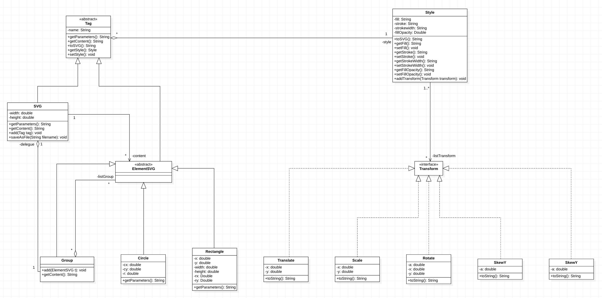
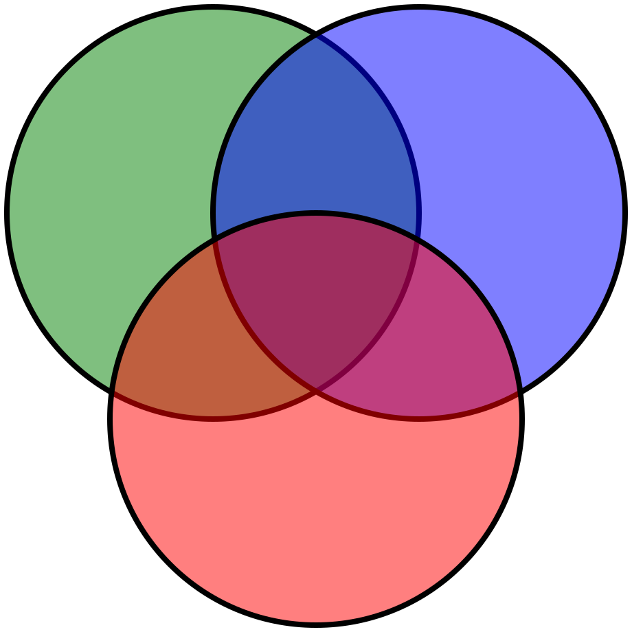
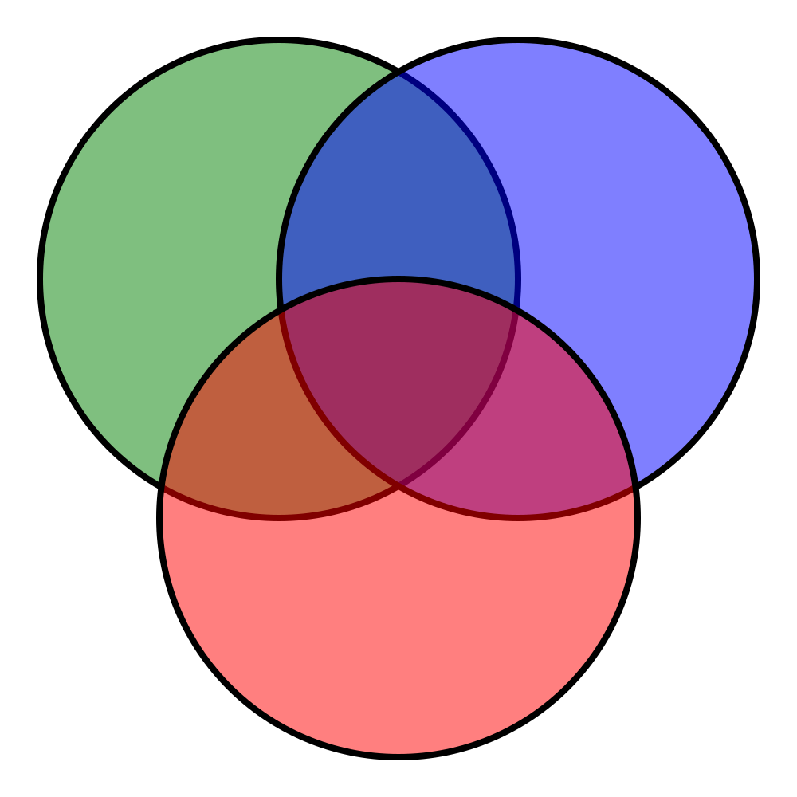
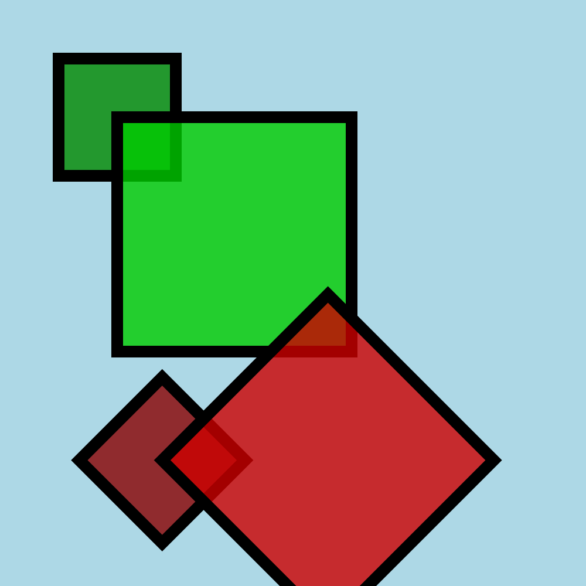

Diagramme de classes de la partie 1 : 
# 

Diagramme class question 8 : 
# 

Question 9 : Les méthodes `void add(ElementSVG t)` et `String getContent()` sont similaires dans `Group` et `SVG`. 
Pour éviter la duplication de code, il suffit d'ajouter un attribut de type `SVG` dans `Group`, d'instancier cet 
attribut dans le constructeur puis, à partir de cet attribut, appeler les fonctions de `SVG` dans les fonctions 
de `Group`.  
Cependant, l'inverse d'ajouter un attribut à `SVG` de type `Group` est également possible mais moins approprié. 

Diagramme de fin :
#

L'image `circle1.svg` correspond à l'image des cercles demandée créée à partir des coordonnées de chaque cercle. 
#

L'image `circle.svg` correspond à l'image des cercles demandée mais cette fois créée avec des transformations de translations. 
#

L'image `square.svg` corresponde à l'image de carrées demandée. 
#